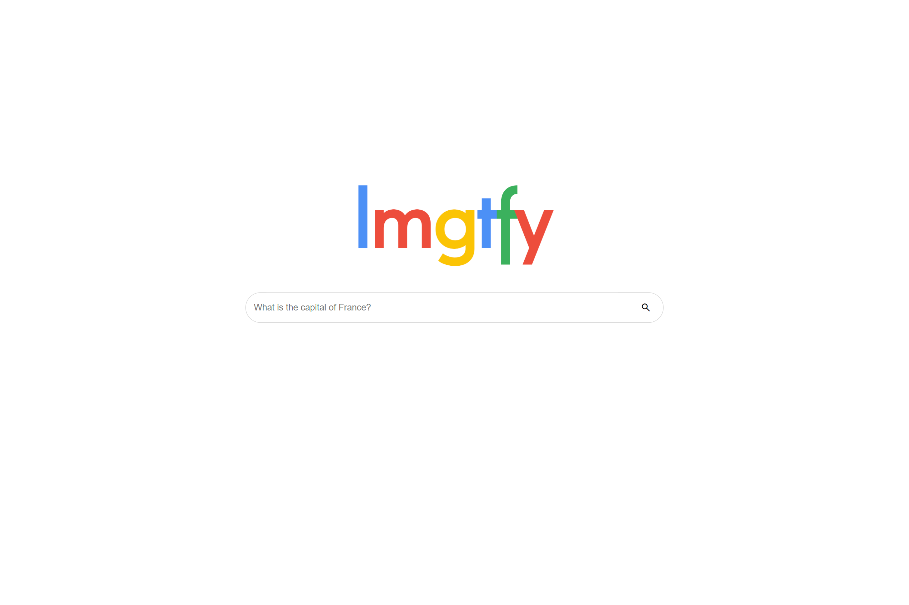

# lmgtfy

A beautiful, modern, simple-to-use and single-file LMGTFY website.

A LMGTFY website generates a short link you can hand out to other people asking dumb questions. When the person clicks the link, a small animation is shown and the user gets redirected to Google (or any other search engine).

## Setup

Setting up the LMGTFY page is simple. Just drag the file from `/src` onto your server.

If you want to host the files in `media` in another location, change the `main` variable in the top of `/src/index.html` to the asset location (without media). So with `main` = `https://example.com/`, assets must be hosted on `https://example.com/media`. This variable changes a few other things as well, like the generated url.

## Changing search engine

To change the pages used search engine is straight forward. Open `/src/index.html` and change the value of `searchEngine` to a URL. You must also include the query location. To so so, add `$1` somewhere in the url; this will get replaced by the given query to search.
